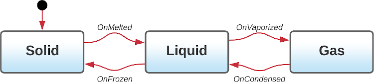
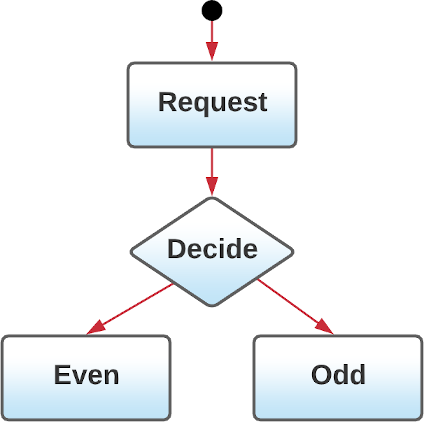

[](https://travis-ci.com/psh/kotlin-state-machine)
[](https://opensource.org/licenses/Apache-2.0)
[](https://shields.io/)
[](https://ktlint.github.io/)

# kotlin-state-machine

## Example State Machine



Our state machine has three states:

```kotlin
sealed class MatterState : State {
    object Solid : MatterState()
    object Liquid : MatterState()
    object Gas : MatterState()
}
```

Allowing us to define a simple state machine for matter:

```kotlin
val stateMachine = graph {
    initialState(Solid)

    state(Solid) {
        allows(Liquid)
    }

    state(Liquid) {
        allows(Solid, Gas)
    }

    state(Gas) {
        allows(Liquid)
    }
}
```

Which can then be driven by calling `transitionTo()`:

```kotlin
stateMachine.start()

// sublimation not allowed - stays in Solid
stateMachine.transitionTo(Gas)

// melt the solid
stateMachine.transitionTo(Liquid)

// vaporize the liquid
stateMachine.transitionTo(Gas)
```

Note: if you prefer, you can have multiple `allows()` definitions rather than the comma-separated list

```kotlin
state(Liquid) {
    allows(Solid)
    allows(Gas)
}
```

## Event Driven State Machine

Transitions between states can be triggered by events:

```kotlin
sealed class MatterEvent : Event {
    object OnMelted : MatterEvent()
    object OnFrozen : MatterEvent()
    object OnVaporized : MatterEvent()
    object OnCondensed : MatterEvent()
}
```

Allowing us to define an event-driven state machine that focuses more on the _edges_ between the nodes (the red arrows
in the state diagram):

```kotlin
val stateMachine = graph {
    initialState(Solid)

    state(Solid) {
        on(OnMelted) {
            transitionTo(Liquid)
        }
    }

    state(Liquid) {
        on(OnFrozen) {
            transitionTo(Solid)
        }
        on(OnVaporized) {
            transitionTo(Gas)
        }
    }

    state(Gas) {
        on(OnCondensed) {
            transitionTo(Liquid)
        }
    }
}
```

Note: defining the state transition using `transitionTo()` implicitly sets up the list of allowed transitions for a
given state; there is no need to use `allows()` when using `transitionTo()`.

This event-driven state machine can then be driven by calling `consume()` or, `transitionTo()`

```kotlin
stateMachine.start()

// sublimation not allowed - stays in Solid
stateMachine.consume(OnVaporized)

// melt the solid
stateMachine.consume(OnMelted)

// vaporize the liquid
stateMachine.transitionTo(Gas)
```

## Code Execution Triggers

The simplest execution triggers are _entry_ and _exit_ of our states:

```kotlin
state(Solid) {
    onEnter {
        // code executed each time we enter the Solid state 
    }

    onExit {
        // code executed each time we leave the Solid state 
    }

    on(OnMelted) { transitionTo(Liquid) }
}
```

However, the state machine also has the concept of _edges_ between the nodes of the graph. It's possible to execute code
as we
_enter_ and _exit_ the transition (that is, at the start and the end of the red lines in the state diagram):

```kotlin
// Event driven style
state(Solid) {
    onEnter { }
    onExit { }

    on(OnMelted) {
        onEnter {
            // code executed each time we enter the 
            // transition state from Solid --> Liquid 
        }

        onExit {
            // code executed each time we exit the 
            // transition state from Solid --> Liquid 
        }

        transitionTo(Liquid)
    }
}

// Non-event driven
state(Liquid) {
    onEnter { }
    onExit { }
    onTransitionTo(Gas) {
        onEnter { }
        onExit { }
    }
}
```

In this scenario, consuming the `OnMelted` event will trigger a transition which will execute the following steps:

1. `Node` Solid OnExit
2. `Edge` Solid --> Liquid OnEnter
3. `Edge` Solid --> Liquid OnExit
4. `Node` Liquid OnEnter

## Decision States



If you include a `decision` in a state definition, it will be executed in preference to the normal `onEnter`. The return
value from the decision lambda will be processed as if `consume()` had been called, with all the normal event handling /
transition rules. A return value `null` or other unhandled event wont cause a transition.

```kotlin
graph {
    initialState(StateA)

    state(StateA) { allows(StateB) }

    state(StateB) {
        decision { /* returns an event, or null */ }
        on(TestEvent) { transitionTo(StateA) }
        on(OtherTestEvent) { transitionTo(StateC) }
    }

    state(StateC)
}
```

## Conditional & Long Running Transitions

By default, state transitions are instantaneous and never fail. You can supply a block of code that will override that
behavior, allowing for long-running operations that have the option to succeed or fail:

```kotlin
state(Solid) {
    on(OnMelted) {
        onEnter { }
        onExit { }
        transitionTo(Liquid)
        execute { result ->
            /* Do something that might take a while */

            if ( /* some condition */ ) {
                result.success()
            } else {
                result.failure()
            }
        }
    }
}
``` 

and for a non-event driven state machines :

```kotlin
state(Solid) {
    onTransitionTo(Liquid) {
        onEnter { }
        onExit { }
        execute { result ->
            /* Do something that might take a while */

            if ( /* some condition */ ) {
                result.success()
            } else {
                result.failure()
            }
        }
    }
}
``` 

By default, when a transition fails, the _exit_ block of the edge will not be called and the state machine will re-enter
the "from" state of the transition.

1. `Node` Solid OnExit
2. `Edge` Solid --> Liquid OnEnter
3. `Node` Solid OnEnter

An application might be tempted to show and hide a progress indicator (`onEnter` / `onExit`) while making a REST service
call (using `execute`)
but the lack of a call to the `onExit` when a transition fails would leave the progress indicator visible. In that case
the call to `failure()`
can be replaced with `failAndExit()` to ensure that the `onEnter` / `onExit` are still executed as a pair.

The execution block can be combined with the call to `transitionTo()` for a more concise syntax

```kotlin
state(Solid) {
    on(OnMelted) {
        transitionTo(Liquid) { result ->
            /* Do something that might take a while */

            if ( /* some condition */ ) {
                result.success()
            } else {
                result.failure()
            }
        }
    }
}
``` 

Note: Be aware that the state machine _will be left in limbo_ (the transition will never complete) if none of the
success or failure methods are called.

## Starting The Machine At A Given State

State machines are defined to be in an _inactive_ state when they are first defined (the large black dot on the state
diagram). A call to `start()` is required to make the initial transition into the defined _initialState_. Optionally a _
machine state_
can be passed into the `start()` method to start the state machine at an arbitrary node in the graph. The state machine
allows either `Inactive` or `Dwelling` machine states to start and will throw an exception if you try to start
with `Traversing`.

```kotlin
@Test
fun `freezing should move us from liquid to solid`() {
    // Given
    stateMachine.start(Dwelling(Liquid))

    // When
    stateMachine.consume(OnFrozen)

    // Then
    assertEquals(Solid, stateMachine.currentState.id)
}
```

The `start()` method can be called at any time (and even multiple times) to reset the state machine to a given node in
the graph.

## Observing State Changes

Suppose you have a basic state machine
```kotlin
val stateMachine = graph {
    initialState(Solid)

    state(Solid) { ... }
    state(Liquid) { ... }
    state(Gas) { ... }
}
```

The graph you build is *observable* - you can observe either the states themselves as things change over time, or the lower-level state transitions (that includes edge traversal)

```kotlin
stateMachine.observeState().collect { state ->
    // called with each state that we land in eg, Solid or Gas
}

stateMachine.observeStateChanges().collect { machineState ->
    // called when dwelling on a particular node, 
    // eg, MachineState.Dwelling( Gas )
    //
    // or when traversing an edge of the graph,
    // eg, MachineState.Traversing( Liquid to Gas )
}

```
